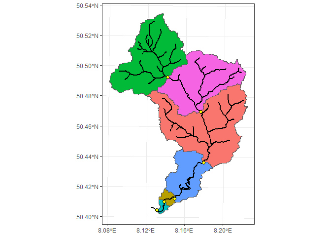
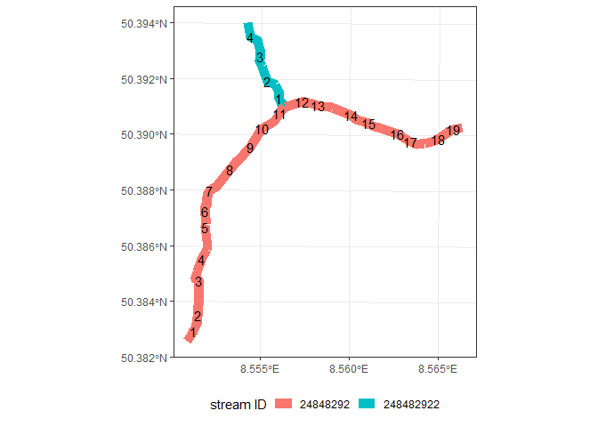
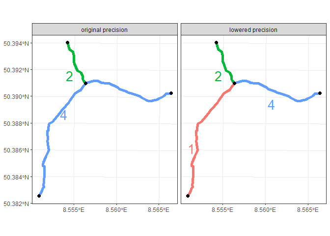

README
================
Daniel Enns
2024-10-17

# Study outline

Freshwater ecosystems exists in very heterogenous landscapes, including
not only natural, but also anthropogenic “spatial features”(Carlisle,
Falcone, and Meador 2008; Marzin, Verdonschot, and Pont 2012; Murphy and
Davy-Bowker 2005). Can these features, like barriers, wastewater
treatment plants, road & railroad crossings, etc. explain the ecological
status of the freshwater fauna? In this study, we try to answer this
question combining various spatial data sets and utilizing machine
learning algorithms (Dedman et al. 2015; Elith, Leathwick, and Hastie
2008; Heß et al. 2023; Yu, Cooper, and Infante 2020).

# Methods

## 1. Combining Spatial Data

### 1.1 Point features

For the spatial analysis all necessary shape and raster files are
projected into EPSG 25832.

Highway and railroad networks can be read in from OpenStreetMap pbf
files via the `osmextract` package. These can be intersected with the
stream network to create point features. In the osm highway and railroad
networks each lane / track is represented as an individual line feature,
so that multiple crossings are present in locations with high lane /
track density.

``` r
# Extract highway and railroad networks
transport_net <- oe_read("./hessen-latest.osm.pbf", extra_tags = "railway") %>%
  filter(highway == "motorway" | railway == "rail") %>% 
  st_transform(st_crs(stream_net))

# Intersect with stream network
crossings <- st_intersection(stream_net, transport_net) %>% 
  st_cast("POINT")
```

### 1.2 Watershed delineation

In order to delineate upstream watersheds for each bio sampling site the
SRTM GL1 30m (OpenTopography 2013) digital elevation model will be used
to extract flow accumulation and pointer grids, from which the
watersheds are calculated. However, the delineation algorithms struggles
in regions with low profiles (namely the Rhine basin), creating an
inaccurate stream raster and watersheds. To improve accuracy, the
existing stream network is burned into the DEM following these steps in
QGIS:

1.  Reproject raster network to stream CRS (EPSG: 25832)

2.  dissolve the stream network

3.  Run the Grass r.carve algorithm with a stream width of 60 m, depth
    of 3 m and with no flat areas in direction of stream flow allowed
    (Note: the algorithm does not work on latitude-longitude CRS, see
    [r.carve GRASS GIS
    manual](https://grass.osgeo.org/grass-stable/manuals/r.carve.html))

The algorithm will take some time to run (approximately 1 hour and 18
minutes with an Intel core i7, 16 GB RAM). Finally, watersheds can be
extracted using the `whitebox` package, following the instructions from
[Gannon,
2024](https://vt-hydroinformatics.github.io/Quarto_Book/15-Watershed-Delineation-and-Analysis.html).

``` r
# Breach and fill pits in raster
wbt_breach_depressions_least_cost(
  dem = "./SRTMGL1_30m_2px_burned.tif", 
  output = "./srtm_breach.tif", 
  dist = 7,
  fill = T
)

# Create flow accumulation & pointer grids
wbt_d8_flow_accumulation(
  input = "./srtm_breach.tif",
  output = "./D8FA.tif"
)

wbt_d8_pointer(
  dem = "./srtm_breach.tif",
  output = "./D8pointer.tif"
)

# Extract streams
wbt_extract_streams(
  flow_accum = "./D8FA.tif",
  output = "./stream_raster.tif",
  threshold = 700
)

# Snap points to stream raster
wbt_jenson_snap_pour_points(
  pour_pts = "./MZB.shp",
  streams = "./stream_raster.tif",
  output = "./MZB_snap.shp",
  snap_dist = 300
)

# Delineate watersheds
wbt_watershed(
  d8_pntr = "./D8pointer.tif",
  pour_pts = "./MZB_snap.shp",
  output = "./watersheds.tif"
)
```

Figure 1 demonstrates the structure of the watersheds, which were build
consecutively between multiple pour points.

<figure>

<figcaption aria-hidden="true">Figure 1: Example watershed. Each
watershed is build consecutively between specified
pourpoints.</figcaption>
</figure>

The created watershed raster can be read in and converted to polygon
features, which subsequently be used to intersect the [CORINE Land
Cover](https://land.copernicus.eu/en/products/corine-land-cover)
polygons. The area of each intersection can be calculated using the
`st_area()` function.

``` r
# Read in Watersheds and convert to polygon 
ws_poly <- read_stars("./watersheds.tif") %>% 
  st_as_sf(as_points = F, merge = T)

# Create dataframe with land cover areas
landcover_ws <- st_intersection(landcover, ws_poly) %>% 
  mutate(area = st_area(.)) %>% st_drop_geometry() %>% 
  as.data.frame() %>% filter(!is.na(type))

# Summarize land cover types in each watershed
landcover_sum <- landcover_ws %>% group_by(watersheds.tif, type) %>% 
  summarize(area = sum(area)) %>% 
  pivot_wider(names_from = type, values_from = area)

# Combine watersheds with summarized land cover
watersheds_lc <- left_join(ws_poly, landcover_sum, by = "watersheds.tif")
```

### 1.3 Network building

The Hessian stream network is a collection of 100 m long line segments,
each containing a stream ID and a segment ID. The stream ID is designed
in such a way, that it consecutively builds upon the ID of a previous
stream segment, adding numbers to it, whenever the stream splits in
upstream direction. The segment number increases towards the source of a
stream (Fig. 2). Each 100 m segment already contains information on the
in-stream and surrounding habitats structural quality (1 - pristine, 7 -
completly altered).

<figure>

<figcaption aria-hidden="true">Figure 2: Example of stream- and segment
ID system. The segment number increases in the direction of the source.
The stream ID of smaller confluence resembels always that of the bigger
stream, in which it flows into, plus additional numbers.</figcaption>
</figure>

The `sfnetwork` package provides many useful functions for network
analysis and routing operations, where the main function
`as_sfnetwork()` builds a network by connecting aligning nodes. An
initial build reveals that many stream segments visually seem connected,
but are separated from their nearest node or edge by a few meters. Thus,
to build a useful network for routing the precision of the stream
network `sf` object needs to be lowered (for more information see
Details on `st_set_precision()` and `st_as_binary()` help page). To what
precision to round depends, in general, on the maximum distance of
dangling nodes and if the network can be build by connecting nodes with
edges, or just by connecting nodes. The precision will be set to 0.01
which rounds to the nearest 2 places before the decimal, corresponding
to 100 meters (be aware of the object CRS units!).

In the resulting network, the right streams are connected (Fig. 3) and
it can be used for routing operations. Performance of routing can be
greatly increased by simplifying the network and removing pseudo-nodes
(more info
[here](https://luukvdmeer.github.io/sfnetworks/articles/sfn02_preprocess_clean.html)).

``` r
# Lower precision to 100 meters
str_net_100m <- st_set_precision(stream_net, 0.01)

# Create sf_network object, simplify and smooth pseudo-nodes
network <- as_sfnetwork(str_net_100m) %>% convert(to_spatial_simple) %>% 
  convert(to_spatial_smooth)
```

<figure>

<figcaption aria-hidden="true">Figure 3: Example for how precision
changes the connectedness of the network. The numbers indicate from
which node a stream originates.</figcaption>
</figure>

Sampling sites and point stressors can be blend in as nodes into the
created network.

``` r
# Blend in sampling sites, wastewater treatment plants and dams
network_blend <- st_network_blend(network, mzb) %>% st_network_blend(.,wwtp) %>% 
  st_network_blend(.,dams)
```

## 2. Spatial Data quantification

For the quantification of point- and polygon features and their
attributes I wrote two custom functions, `st_shift()` and
`upstream_summarize()`. The first function is required within the latter
and shifts a set of point geometries a proportional distance towards
another specified point. The `upstream_summarize()` function builds a
sub-network from a given point to all its vertices (stream sources) and
extracts the node data, from which it counts the number of specified
nodes and sums up specified attribute values. Further, if provided, it
can sum up attribute values of polygons the following way: First, the
set of nodes present in the sub-network are shifted towards their
centroid by 0.1% of their length, to avoid including adjacent polygons.
Then, it creates a filtering mask by selecting all polygons which are
touched by the shifted nodes and fills in ‘holes’ in the set of
polygons. By setting a threshold, the mask can be shrunken to avoid
selecting adjacent polygons. This mask is finally used to select all
polygons present in the sub-network, from which their specified
attributes are summarized. The function contains the following set of
arguments:

- `net` : The complete network with blended in points of interest
- `start` : Row name of node from which to rout upstream
- `node_cols` : Names of attribute columns to summarize, present in
  nodes
- `IDs` : ID columns for sets of nodes, which should be unique in each
  set
- `area` : `sf` object with only polygon geometries
- `area_cols` : names of attribute columns to summarize, present in
  `area`
- `threshold` : Value (in polygon CRS units) by which the polygon mask
  should be shrunken.

Before this function can be used, the points from which the function
should rout must be extracted as nodes from the network and their row
name must be saved as a new column.

``` r
# Extract nodes of invertebrate sampling sites and add row names
mzb_nodes <- st_as_sf(network_blend, "nodes") %>% filter(!is.na(ID_SITE)) %>% 
  mutate(ID_NODE = row.names(nodes)[with(nodes, !is.na(ID_SITE))])
```

`upstream_summarize()` can be used in combination with rowwise() and
mutate() to perform the action over multiple points. Depending on the
number of nodes within the entire network, this task can take quite a
lot of time.

``` r
# Apply upstream_summarize row-wise over all sampling site nodes 
mzb_data_complete <- mzb_nodes %>% rowwise() %>% 
  mutate(upstream_summarize(
    net = network_blend,
    start = ID_NODE,
    node_cols = c("population_equivalents", "dam_discharge"),
    IDs = c("ID_WWTP", "ID_DAMS"),
    area = ws_clc,
    area_cols = c("Agriculture", "Urban", "semi-Natural"),
    threshold = 30)
    )
```

## 3. Modeling

## 4. Data availability

Data on WFD invertebrate sampling and the Hessian stream network were
kindly provided by the Hessian state office for nature, environment and
geology (HLNUG). Data on wastewater treatment plants, stormwater
overflows are available for download from the
[WRRL-viewer](https://wrrl.hessen.de/mapapps/resources/apps/wrrl/index.html?lang=de).
Further, data on hydrological barriers are available from the [Amber
Barrier Atlas](https://amber.international/european-barrier-atlas/).
OpenStreetMap data can be downloaded as pbf files at
[geofabrik](https://download.geofabrik.de/). CORINE land cover
shapefiles and rasters are available at [Copernicus Land Monitoring
Service](https://land.copernicus.eu/en/products/corine-land-cover). The
SRTM GL1 30m digital elevation model can be downloaded from
[OpenTopography](https://portal.opentopography.org/raster?opentopoID=OTSRTM.082015.4326.1).

<div id="refs" class="references csl-bib-body hanging-indent"
entry-spacing="0">

<div id="ref-carlisle2008" class="csl-entry">

Carlisle, Daren M., James Falcone, and Michael R. Meador. 2008.
“Predicting the Biological Condition of Streams: Use of Geospatial
Indicators of Natural and Anthropogenic Characteristics of Watersheds.”
*Environmental Monitoring and Assessment* 151 (1-4): 143–60.
<https://doi.org/10.1007/s10661-008-0256-z>.

</div>

<div id="ref-dedman2015" class="csl-entry">

Dedman, Simon, Rick Officer, Deirdre Brophy, Maurice Clarke, and David
G. Reid. 2015. “Modelling Abundance Hotspots for Data-Poor Irish Sea
Rays.” *Ecological Modelling* 312 (September): 77–90.
<https://doi.org/10.1016/j.ecolmodel.2015.05.010>.

</div>

<div id="ref-elith2008" class="csl-entry">

Elith, J., J. R. Leathwick, and T. Hastie. 2008. “A Working Guide to
Boosted Regression Trees.” *Journal of Animal Ecology* 77 (4): 802–13.
<https://doi.org/10.1111/j.1365-2656.2008.01390.x>.

</div>

<div id="ref-heß2023" class="csl-entry">

Heß, Sebastian, Delia Hof, Matthias Oetken, and Andrea Sundermann. 2023.
“Effects of Multiple Stressors on Benthic Invertebrates Using Water
Framework Directive Monitoring Data.” *Science of The Total Environment*
878 (June): 162952. <https://doi.org/10.1016/j.scitotenv.2023.162952>.

</div>

<div id="ref-marzin2012" class="csl-entry">

Marzin, Anahita, Piet F. M. Verdonschot, and Didier Pont. 2012. “The
Relative Influence of Catchment, Riparian Corridor, and Reach-Scale
Anthropogenic Pressures on Fish and Macroinvertebrate Assemblages in
French Rivers.” *Hydrobiologia* 704 (1): 375–88.
<https://doi.org/10.1007/s10750-012-1254-2>.

</div>

<div id="ref-murphy2005" class="csl-entry">

Murphy, John F., and John Davy-Bowker. 2005. “Spatial Structure in Lotic
Macroinvertebrate Communities in England and Wales: Relationship with
Physical, Chemical and Anthropogenic Stress Variables.” *Hydrobiologia*
534 (1-3): 151–64. <https://doi.org/10.1007/s10750-004-1451-8>.

</div>

<div id="ref-opentopography2013" class="csl-entry">

OpenTopography. 2013. “Shuttle Radar Topography Mission (SRTM) Global.”
<https://doi.org/10.5069/G9445JDF>.

</div>

<div id="ref-yu2020" class="csl-entry">

Yu, Hao, Arthur R. Cooper, and Dana M. Infante. 2020. “Improving Species
Distribution Model Predictive Accuracy Using Species Abundance:
Application with Boosted Regression Trees.” *Ecological Modelling* 432
(September): 109202. <https://doi.org/10.1016/j.ecolmodel.2020.109202>.

</div>

</div>
