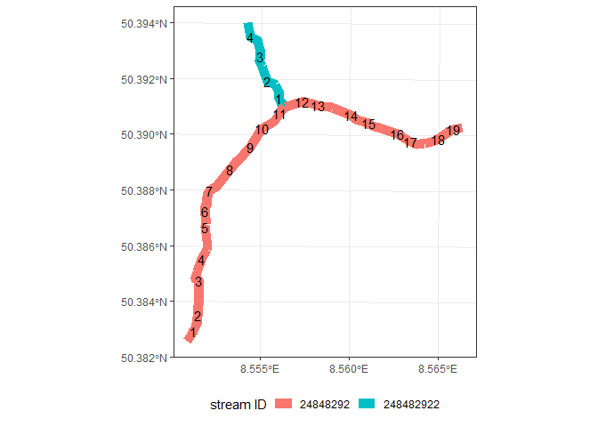

README
================
Daniel Enns
2024-10-17

# Study outline

Freshwater ecosystems exists in very heterogenous landscapes, including
not only natural, but also anthropogenic “spatial features”[^1]. Can
these features, like barriers, wastewater treatment plants, road &
railroad crossings, etc. explain the ecological status of the freshwater
fauna? In this study, we try to answer this question combining various
spatial data sets and utilizing machine learning algorithms[^2].

# Methods

## Combining Spatial Data

For the spatial analysis all necessary shape and raster files are
projected into EPSG . The HLNUG stream network is a collection of 100 m
long line segments, each containing a stream ID and a segment ID. The
stream ID is designed in such a way, that it represents the one from the
subsequent stream in which the current flows into, followed by
additional numbers. The segment number increases towards the source of a
stream (Fig. 1). Each 100 m segment already contains information on the
habitats structural quality (1 - pristine, 7 - completly altered).

<figure>

<figcaption aria-hidden="true">Fig. 1: Example for stream- and segment
ID. The segment number increases in the direction of the source. The
stream ID of smaller confluence resembels always that of the bigger
stream, in which it flows into, plus additional numbers.</figcaption>
</figure>

The stream network can be dissolved in QGIS using the dissolve tool and
subsequently we can build an initial landscape network (LSN) using the
`lines_to_lsn()` function from the
[SSNbler](https://cran.r-project.org/web/packages/SSNbler/index.html)
package, where we set the snap tolerance of nodes to 3 m and the
topology tolerance to 30 m (note that the digitized flow needs to lead
from source to outlet points). The summary of the node error report
reveals that the network is highly erroneous. (For more detail on the
LSN parameters and error types see [Peterson & Pearse
2024](https://github.com/pet221/SSNbler/blob/main/inst/tutorials/Topology_Editing/QGIS/TopologyEditing_QGIS.pdf))

    ##     pointid            nodecat                            error      
    ##  Min.   :    2   Confluence: 9239   Converging Node          :   54  
    ##  1st Qu.: 5190   Outlet    :10167   Dangling Node            :19172  
    ##  Median :10508                      Downstream Divergence    :   88  
    ##  Mean   :10509                      Intersection Without Node:   88  
    ##  3rd Qu.:15804                      Unsnapped Node           :    4  
    ##  Max.   :21137                                                       
    ##  NA's   :9149                                                        
    ##             geom      
    ##  POINT        :19406  
    ##  epsg:25832   :    0  
    ##  +proj=utm ...:    0  
    ##                       
    ##                       
    ##                       
    ## 

Fixing topological errors in the entire network, manually and using
GRASS GIS tools, would take too much time.

[^1]: [Carlisle et al. 2009](https://doi.org/10.1007/s10661-008-0256-z);
    [Marzin et al. 2013](https://doi.org/10.1007/s10750-012-1254-2);
    [Murphy & Davy-Bowker
    2005](https://doi.org/10.1007/s10750-004-1451-8)

[^2]: [Dedman et
    al. 2015](http://dx.doi.org/10.1016/j.ecolmodel.2015.05.010); [Elith
    et al. 2008](https://doi.org/10.1111/j.1365-2656.2008.01390.x); [Heß
    et al. 2023](http://dx.doi.org/10.1016/j.scitotenv.2023.162952); [Yu
    et al. 2020](https://doi.org/10.1016/j.ecolmodel.2020.109202)
